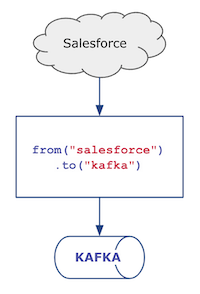

# Camel extensions for Quarkus: Salesforce CDC example



## Prerequisites
### Salesforce
To run the `cdc-salesforce` integration example, you must first create a Salesforce developer account https://developer.salesforce.com/.

Next create a new 'Connected App' from the app manager page. You may need to adjust the OAuth policy settings for
`Permitted Users` and also `IP Relaxation` rules, depending on your needs. Also enable Change Data Capture for the 'Account' entity by visiting the Integrations -> Change Data Capture page.

### Kafka
Install kafka and create topics with the same names as Salesforce entities in lower case.

## Configuration

Set Salesforce authentication and Kafka configuration attributes in `application.properties`

## Running the application in dev mode

You can run your application in dev mode that enables live coding using:
```shell script
./mvnw compile quarkus:dev
```

## Packaging and running the application

The application can be packaged using:
```shell script
./mvnw package
```
It produces the `quarkus-run.jar` file in the `target/quarkus-app/` directory.
Be aware that it’s not an _über-jar_ as the dependencies are copied into the `target/quarkus-app/lib/` directory.

If you want to build an _über-jar_, execute the following command:
```shell script
./mvnw package -Dquarkus.package.type=uber-jar
```

The application is now runnable using `java -jar target/quarkus-app/quarkus-run.jar`.
